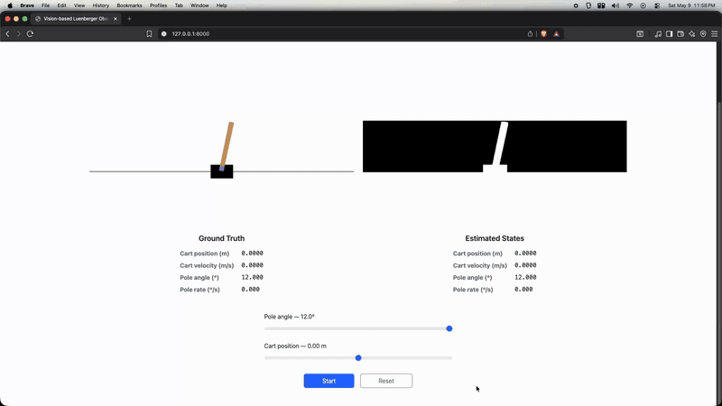

# pixelsToSteps

Cartpole stabilisation from pixels alone, with no angle or cart position sensor at inference time. Implements the linear vision-based control framework of Lee et al., ["From Pixels to Torques with Linear Feedback"](https://arxiv.org/abs/2406.18699), adapted for simulation in Gym CartPole.

The key result: a **student policy trained on 40 teacher demos achieves 100% survival across 100 random initial conditions** under true plant mismatch, running as a single matrix multiply at 60 Hz.

> See the accompanying [report](report.pdf) for full derivations and evaluation.

---



---

## Method

The approach separates the control problem into two phases.

**Data collection.** A privileged teacher with full state access runs an LQR policy and logs $(x_k, u_k, \text{frame}_k)$ tuples. The gain $K$ is computed offline by solving the discrete-time algebraic Riccati equation (DARE):

$$P = A^\top P A - (A^\top P B)(R + B^\top P B)^{-1}(B^\top P A) + Q, \qquad K = (R + B^\top P B)^{-1} B^\top P A$$

**Observer training.** A hybrid Luenberger observer is fit to the collected data. The nominal dynamics matrices $A_L$, $B_L$ are fixed from linearisation around the upright equilibrium; only the pixel-to-angle mapping is learned via Ridge regression:

$$\hat{\theta}_\text{pixel} = \mathbf{w}^\top \mathbf{y}_k + b, \qquad \mathbf{w}, b = \arg\min_{\mathbf{w},b} \|\Theta - Y\mathbf{w} - b\|^2 + \alpha\|\mathbf{w}\|^2$$

**Inference.** At each step the observer fuses nominal dynamics with the pixel estimate using a fixed blend weight $\alpha = 0.7$:

$$\hat{x}_{k+1} = A_L \hat{x}_k + B_L u_k, \qquad \hat{x}_k[2] \leftarrow (1-\alpha)\,\hat{x}_{k+1}[2] + \alpha\,\hat{\theta}_\text{pixel}$$

$$u_k = -K\hat{x}_k$$

No angle sensor is used. The observer sees only binary pixel frames produced by Gaussian blur + Otsu thresholding of the Gym render.

---

## Results

Evaluated on 100 trials with $\theta_0 \sim \text{Uniform}(-12°, +12°)$, 2.5 s horizon, true plant mismatch (pole mass x1.1, half-length x0.9):

| Demos | Pixel→angle $R^2$ | Pixel→angle RMSE | Survival | Paper-success* |
|-------|-------------------|-------------------|----------|----------------|
| 20 | 0.980 | 0.181° | 96/100 | 75/100 |
| **40** | **0.987** | **0.123°** | **100/100** | **72/100** |

\* paper-success: $|\hat{x}| \leq 0.176\,\text{m}$, $|\hat{\theta}| \leq 2°$ at $t = 2.5\,\text{s}$

The jump from 20 to 40 demos eliminates all failures and collapses the 95th-percentile $e_\text{stab}$ from 0.898 to 0.487.

**Why 72% paper-success is a meaningful result.** The original paper's observer corrects all 4 states (cart position, cart velocity, pole angle, and pole angular rate) directly from pixels. This implementation corrects only $\hat{\theta}$ (1 state); cart position is propagated entirely by the open-loop dynamics model with no pixel correction. Achieving 100% survival under plant mismatch with this simplified single-state observer demonstrates that angle correction alone is sufficient for closed-loop stabilisation, and that the framework degrades gracefully when the pixel-to-state mapping is restricted. The 72% paper-success rate reflects residual cart position drift (the estimated $\hat{x}$ accumulates open-loop error), not instability. See [eval_results_comparison.md](simulation/python/eval_results_comparison.md) for a full breakdown.

---

## Quickstart

**Requirements:** Python 3.9+

```bash
git clone https://github.com/<you>/pixelsToSteps.git
cd pixelsToSteps
python3 -m pip install -r simulation/python/requirements.txt
```

**Run the live web UI** (streams Gym renders, binary observations, and telemetry):

```bash
python3 -m uvicorn simulation.web.app:app --host 127.0.0.1 --port 8000
```

Then open `http://127.0.0.1:8000` and click **Reset → Start**.

**Reproduce the evaluation from scratch:**

```bash
# 1. Collect 40 teacher demos
python3 simulation/python/collect_teacher_demos.py \
    --steps 600 \
    --theta0-deg-list $(seq -s' ' -12 0.5 -0.5) $(seq -s' ' 0.5 0.5 12) \
    --collection-id my_40demos

# 2. Train the hybrid observer
python3 simulation/python/train_hybrid_observer.py \
    --collection-dir simulation/captures/collections/my_40demos \
    --output-json simulation/python/my_observer.json

# 3. Evaluate on 100 random initial conditions
python3 simulation/python/eval_initial_conditions.py \
    --observer-json simulation/python/my_observer.json \
    --n-trials 100 --steps 150
```

Or use the pre-trained observer directly:

```bash
python3 simulation/python/teacher_policy.py \
    --steps 150 --theta0-deg 12 \
    --true-masspole-scale 1.1 --true-half-pole-length-scale 0.9 \
    --observer-json simulation/python/hybrid_pixels_to_cartpole_observer_theta_blend_0p7.json
```
